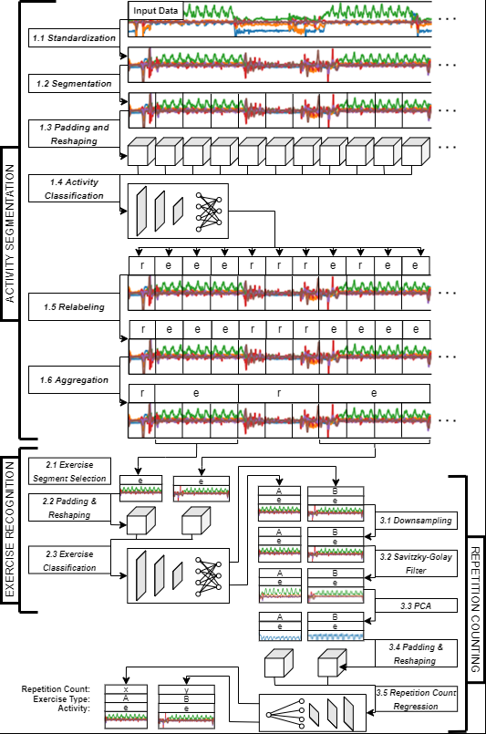
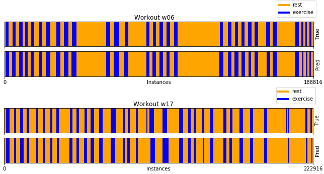
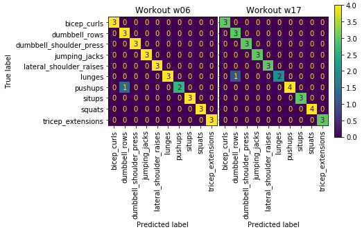

# Exercise Segmentation, Recognition and Repetition Counting for Time Series Data
A fully convolutional neural network-based end-to-end workflow for segmentation, recognition and repetition counting of accelerometer and gyroscope fitness data generated by a wrist-worn smartwatch.

## Description
The project displays a three-step approach. The first step, being segmentation, slides a window across the workout data and uses a CNN for classifying each window segment as either 'rest' or 'exercise'. The second step uses a CNN for recognizing the exercise type performed inside each of the determined exercise segments. There are 10 different exercise types (e.g. 'squats', 'pushups' etc.). The third step counts the number of performed repetitions inside each determined exercise segment by using a CNN for regression.

## Workflow

## Data
MM-Fit dataset: https://mmfit.github.io/ 
RecoFit dataset: https://msropendata.com/datasets/799c1167-2c8f-44c4-929c-227bf04e2b9a

## Assessment Methods
Segmentation quality is assessed based on three measures: 
 
a) Segment Miscount Rate:
Percentage of deviation of predicted segment count from true segment count.
 
b) Mean Position Error: 
Mean difference in seconds of start and end of predicted segment w.r.t. start and end of the corresponding true segment.
 
c) Classification Accuracy (Segmentation): 
Percentage of correctly classified segments among all predicted segments.
 
 
Exercise recognition quality is assessed based on:
 
d) Classification Accuracy (Recognition): 
Percentage of correctly classified exercise segments among all classified exercise segments.
 
 
Repetition counting quality is assessed based on three measures:
 
e) Percentage of predicted counts within +-0, +-1 and +-2 repetitions of the corresponding true repetition count.
 
f) Mean Absolute Error
 
g) Mean Squared Error

## Results
Results are averaged across two test data workouts and given for end-to-end simulation, in which errors committed by previous steps trickle down to the succeeding steps. Results were produced by the models given in the 'models' directory, which were trained in the training files. 
 
### Segmentation

a) Segment Miscount Rate: 11.6 % 
b) Mean Position Error: 4.75 s 
c) Classification Accuracy: 100 % 
 
### Exercise Recognition

d) Recognition Accuracy: 93.93 % 
Since the segmentation step predicted two too many exercise segments for workout w17, those two segments are treated as false predictions. Therefore, the exercise recognition
accuracy for workout w17 is not 96.88%, but 91.18% instead. With the exercise segment count of workout w06 having been predicted correctly, and therefore not causing any penalty, the recognition accuracy given above is the average of the recognition accuracy of workout w06 (96.67%) and the corrected recognition accuracy of workout w17 (91.18%).
 
### Repetition Counting
| Within +-0 repetitions | Within +-1 repetitions | Within +-2 repetitions | Mean Absolute Error | Mean Squared Error |
| ---------------------- | ---------------------- | ---------------------- | ------------------- | ------------------ |
|        29.71 %         |        69.22 %         |         77.36 %        |         1.35        |        3.36        |

## Package Versions
python---3.7.6 
matplotlib---3.1.3 
numpy---1.21.6 
pandas---1.0.1 
scipy---1.1.0 
sklearn---0.22.1 
tensorflow---2.9.1 

## Copyright Notice
The software provider does not represent or warrant that it has any rights whatsoever in the data used.
Neither the software provider, nor any upstream software or data provider shall have any liability for any direct, indirect, incidental, special, exemplary, or consequential damages (including without limitation lost profits), however caused and on any theory of liability, whether in contract, strict liability, or tort (including negligence or otherwise) arising in any way out of the software, the data used or the produced results, even if advised of the possibility of such damages.
